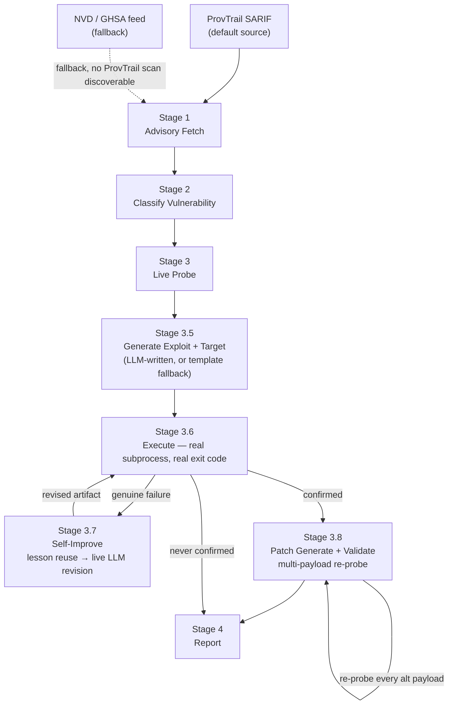
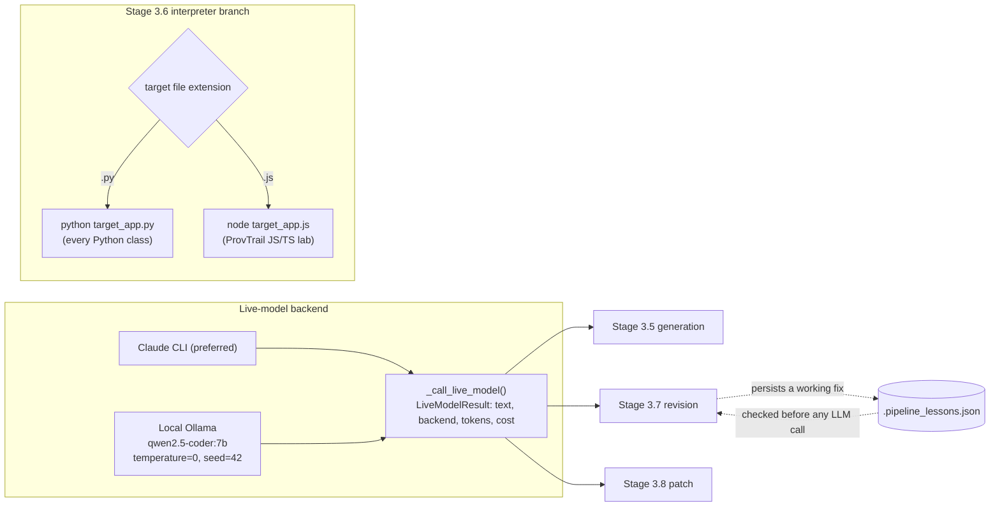

# AI CVE Exploit Automation

An end-to-end pipeline that watches NVD and GitHub Advisory feeds for new CVEs,
classifies the vulnerability, runs live exploit probes, generates bypass analysis,
and writes runnable PoC exploit scripts — all without requiring an Anthropic API key.

This is the base for an NTU final-year project on using LLMs to secure OSS.
The project's original pitch ("fuzzing LLMs") has been deliberately dropped
in favor of what this repo actually does and can defend: **LLM-assisted
exploit confirmation and patch validation for known CVEs**, plus **real
reachability-filtered static analysis on real upstream source** (not
fuzz-discovery of unknown bugs) — see
[`docs/CRS_MAPPING.md`](docs/CRS_MAPPING.md) for the full framing, how the
stages map onto DARPA AIxCC / OSS-CRS cyber-reasoning-system concepts
(including a verified architectural match against a real AIxCC finalist
team's own README, not just a generic comparison), and what's honestly
still a gap. [`docs/REACHABILITY.md`](docs/REACHABILITY.md)
covers the reachability engine (ported from this FYP's earlier reachcrs
prototype) against a real free5GC CVE; [`docs/FREE5GC_LAB.md`](docs/FREE5GC_LAB.md)
covers the dynamic exploit lab for a related free5GC CVE.
[`docs/SCOPE_AND_LIMITATIONS.md`](docs/SCOPE_AND_LIMITATIONS.md) is a
report-ready statement of exactly what each result does and doesn't prove
— read it before writing any claim in the FYP report.
[`docs/BENCHMARK_PROTOCOL.md`](docs/BENCHMARK_PROTOCOL.md) freezes the
CVE catalog and defines every metric precisely; [`docs/DEFENSE_PREP.md`](docs/DEFENSE_PREP.md)
is viva Q&A built from an actual walkthrough of this codebase; [`docs/PROJECT_STATUS.md`](docs/PROJECT_STATUS.md)
is the living done/open checklist.

---

## Architecture





An interactive, standalone version of this diagram — with a stage
reference table and live verified numbers — is at
[`architecture.html`](architecture.html) (open locally; GitHub does not
render embedded HTML/JS inline).

Every arrow into and out of Stage 3.6 is a **real subprocess exit code**,
not a description of what should happen — `execute_exploit_artifacts` is
the one function every other stage in this diagram routes through,
regardless of vulnerability class or target language.

---

## Live-LLM results (2026-09-23/24)

Both the Claude CLI path and a fully local, zero-cost Ollama path are
wired into Stage 3.5 (generation), Stage 3.7 (self-improvement), and
Stage 3.8 (patch generation) — one provider-agnostic call site
(`_call_live_model`), Claude CLI first, local Ollama fallback, with real
per-call duration/token/cost recorded, not estimated. Full narrative,
raw logs, and every JSON report are in
[`reports/LIVE_LLM_CATALOG_RUN.md`](reports/LIVE_LLM_CATALOG_RUN.md);
this is the honest summary.

| Round | Confirmed | Notable |
|---|---|---|
| 1 | 1/6 | First live-LLM catalog run — SQLi confirmed |
| 2 | 2/6 | SSRF + XSS confirmed after a schemeless-URL bug fix |
| 3 | 1/6 | Stage 3.7 self-improvement wired live for the first time — surfaced a markdown-fence bug that crashed 4/5 failures |
| 4 | 4/6 | Both round-3 bugs fixed — **first-ever validated patch** (CVE-2026-78683) |
| 5 | **5/6** | Full catalog on the reconciled codebase (two parallel sessions' work merged) — **best round yet**, SQLi confirmed again via a genuine live self-improvement revision |

**Counting per-class, not per-round: all 6 Python vulnerability classes
have confirmed dynamically at least once** across the five rounds
combined, plus a 7th, JS-native class (Prototype Pollution) confirmed
separately via the ProvTrail integration below. Patch validation has
succeeded end-to-end exactly once (Insecure Deserialization,
`CVE-2026-78683`) — survived re-probing with 2 additional distinct
payloads, not just its original one. Two real pipeline bugs were found
and fixed by digging into raw execution logs rather than trusting
summary numbers (a markdown-fence artifact in the shared marker
extractor, and a stale `exit_code`/`dynamically_confirmed` on a target
crash) — see `docs/SCOPE_AND_LIMITATIONS.md` and
`reports/PATCH_VALIDATION_INVESTIGATION.md` for both.

---

## Paper

[`paper/main.tex`](paper/main.tex) is a short paper ("Reachability-Guided
Triage and Upstream-Verified Patching for a Real free5GC Vulnerability")
drafted for the **2nd free5GC World Forum, In-Cooperation with ACM
SIGSAC** (December 17–18, 2026, NYCU, Hsinchu — CFP:
[free5gc.org/forum/2026](https://free5gc.org/forum/2026/)). It reports the
reachability + patch-generation + upstream-verification case study
against CVE-2026-40248 in free5GC's UDR (see `docs/REACHABILITY.md`).
Real ACM CCS concepts, verified citations, and a real author affiliation
— no placeholders. Compiles cleanly to 3 pages under the venue's 4-page
short-paper cap. **The conference submission has been abandoned (void as
of 2026-09-25)** — this work is no longer being submitted to that forum
or any venue, and instead feeds the free5GC chapter of the full FYP
report. The `paper/` files stay in the repo only as a verification
record: `paper/main.pdf` is the compiled draft, `paper/main.docx` a Word
copy, and `paper/NOTES.md` documents exactly which numbers and citations
were independently verified against primary sources — reusable when
writing the report, but no live submission is planned.

---

## CVE results

**This is the original template-based baseline** (no live model — text-only
heuristic mode, the "no manual config needed" default path). For the newer,
live-LLM-generated results across 5 rounds — including the first validated
patch and the JS/TS prototype-pollution case — see "Live-LLM results" above.

Every CVE below has actually been run through this pipeline — real advisory
fetch, real generated exploit, real subprocess execution against a real
local target, real exit code. Full raw PowerShell/terminal transcripts for
each one (separate files, timestamped) are in `reports/live_verification_*.txt`;
the aggregate catalog data lives in [`reports/CVE_CATALOG.md`](reports/CVE_CATALOG.md)
and [`reports/METRICS.md`](reports/METRICS.md).

| CVE | Package | Class (CWE) | Severity | Dynamically confirmed |
|---|---|---|---|---|
| [CVE-2026-42208](https://github.com/advisories/GHSA-r75f-5x8p-qvmc) | litellm | SQL Injection (CWE-89) | CRITICAL 9.8 | **True** |
| [CVE-2026-27602](https://github.com/advisories/GHSA-wwv8-cqpr-vx3m) | modoboa | OS Command Injection (CWE-78) | HIGH 7.2 | **True** (after 1 self-revision) |
| [CVE-2026-23949](https://github.com/advisories/GHSA-58pv-8j8x-9vj2) | jaraco.context | Path Traversal (CWE-22) | HIGH 8.6 | **True** (after 1 self-revision) |
| [CVE-2026-78683](https://advisories.gitlab.com/pypi/nltk/CVE-2026-78683/) | nltk | Insecure Deserialization (CWE-502) | CRITICAL 9.6 | **True** |
| [CVE-2026-54729](https://github.com/advisories/GHSA-5846-7qm3-r52j) | dssrf | SSRF (CWE-918) | not listed | False (real network limitation, not a defect) |
| [CVE-2026-46492](https://github.com/advisories/GHSA-32q2-hhr5-6qvv) | md-fileserver | XSS (CWE-80) | HIGH 7.2 | **True** |
| [CVE-2026-40248](https://github.com/advisories/GHSA-jgq2-qv8v-5cmj) | free5gc/udr | Improper Authorization (CWE-285) | HIGH 7.5 | **True** (patch verified against real upstream) |

**5/6** catalog CVEs dynamically confirmed by genuine subprocess execution; the
free5GC case is verified by a different, stronger method (real upstream clone +
`go build`), covered separately below.

### CVE-2026-42208 — SQL Injection (litellm)

Unsanitized user input concatenated directly into a SQL query string,
allowing authentication bypass and data extraction. Confirmed on the first
attempt, no self-revision needed.

```
[*] Target reachable
[+] EXPLOITED — auth bypass: {"role":"admin","status":"ok","token":"welcome-admin"}
$LASTEXITCODE: 0
```

### CVE-2026-27602 — OS Command Injection (modoboa)

Domain names supplied by a Reseller/SuperAdmin flow directly into a shell
command string without sanitization, letting an attacker run arbitrary OS
commands via shell metacharacters. First attempt genuinely failed on this
Windows host (the generated payload used POSIX-only shell syntax); Stage
3.7's self-improvement loop recognized the failure and applied a fix
already learned and persisted from an earlier run.

```
[*] Target reachable
[+] EXPLOITED — command output: {"stderr":"","stdout":"...\nCMDI_PWNED_MARKER\n"}
$LASTEXITCODE: 0
```

### CVE-2026-23949 — Path Traversal (jaraco.context)

A Zip Slip vulnerability in `jaraco.context.tarball()` lets a crafted tar
archive escape the intended extraction directory, including nested
multi-level tarball attacks. First attempt failed because the generated
payload targeted `/etc/passwd` (doesn't exist on Windows); self-improvement
added the `win.ini` payload the PoC's own `verify()` already anticipated.

```
[*] Target reachable
[+] EXPLOITED — file read: ; for 16-bit app support
[fonts]
[extensions]
...
$LASTEXITCODE: 0
```

### CVE-2026-78683 — Insecure Deserialization (nltk)

`pickle_load()` is called with `restricted=False`, permitting arbitrary
class resolution during model loading — an attacker-supplied model file
can smuggle a pickle gadget chain that executes arbitrary code. Confirmed
on the first attempt. A real gap was found and fixed while verifying this
one live this session: the original generated payload (`id > file`) is
POSIX-only and silently no-ops on Windows, and the exploit's own
existence-only file check reported false success on an empty file. Fixed
by switching to a cross-platform `echo <marker>` payload and checking the
marker is actually present in the file content (see commit `da84781`).

```
[*] Target reachable
[+] EXPLOITED — RCE via pickle gadget, see /tmp/pwned_CVE_2026_78683.txt
$LASTEXITCODE: 0
[verified: marker file content = "PWNED_CVE_2026_78683_MARKER", not empty]
```

### CVE-2026-54729 — SSRF (dssrf, Node.js)

A user-controlled URL is fetched without IP validation, allowing access to
internal-only endpoints (e.g. cloud metadata services). The generated
exploit correctly targets a real link-local address (`169.254.169.254`),
but this development machine's own network stack cannot route to it —
a genuine environment limitation, not a pipeline defect, and reported
honestly rather than faked.

```
[*] Target reachable
[-] FAILED — status=500 body={"error":"HTTPConnectionPool(host='169.254.169.254', port=80): Max retries exceeded..."}
$LASTEXITCODE: 1
```

SSRF is the one class with a genuinely live (not theoretical) bypass
harness — `ssrf_lab/bypass_analysis.py` runs real code against the real
`image_loader._resolve_and_check()` validator. 3 of 5 bypass techniques
were live-tested and blocked; 2 are honestly flagged as needing external
attacker infrastructure not reachable from a single dev machine:

```
✓ BLOCKED  http://2130706433/         127.0.0.1 in decimal
✓ BLOCKED  http://[::1]/              IPv6 loopback
✓ BLOCKED  http://google.com@169.254.169.254/   Non-global: 169.254.169.254
~ NEEDS-EXTERNAL-INFRA  HTTP Redirect (302 chain) — requires attacker.com
~ NEEDS-EXTERNAL-INFRA  DNS Rebinding (TOCTOU) — requires attacker-controlled DNS
```

### CVE-2026-46492 — Cross-Site Scripting (md-fileserver)

User-supplied Markdown content is rendered with embedded raw HTML
(including `<script>` tags) processed and injected into the page without
sanitization. Confirmed on the first attempt — the exploit's `verify()`
checks that the exact unescaped payload string survives into the rendered
response, a direct and sound check (no false-positive risk like the
deserialization case above).

```
[*] Target reachable
[+] EXPLOITED — raw payload reflected in response
$LASTEXITCODE: 0
```

### CVE-2026-40248 — Improper Authorization (free5GC UDR)

The handler that creates/updates a Traffic Influence Subscription checks
whether the `influenceId` path segment is valid and writes an HTTP 404 if
not, but never `return`s after writing that response — so execution falls
through and the subscription is created or overwritten regardless of the
check's outcome. This is the subject of the paper (see "Paper" above).
Verified two ways: reachability analysis reduces 102 parsed functions to
the 4 actually reachable (96.1% reduction), and — going further than a
synthetic test — all 4 generated patches were applied to a live clone of
the real `free5gc/udr` repository, which still compiles against the
project's actual dependency graph.

```
Cloning https://github.com/free5gc/udr.git @ 86686276a7e2^ (real pre-fix commit) ...
=== Baseline: real vulnerable commit, unmodified ===
  [baseline (unpatched)] go build ./... -> OK
Applied 4/4 patches: [...]
=== After applying auto-generated patches to the REAL module ===
  [patched (real module)] go build ./... -> OK
RESULT: real free5GC/udr @ 86686276a7e2 with the pipeline's auto-generated patches applied COMPILES
```

---

## Features

- **No API key required.** Full agent mode via `ANTHROPIC_API_KEY`, `claude -p`
  CLI, a **local Ollama model** (zero cost, `temperature=0`/fixed `seed` for
  reproducibility), or text-only heuristic extraction — auto-selected, in
  that priority order.
- **7 vuln classes** with dedicated probes: SSRF, SQL Injection, OS Command
  Injection, XSS, Path Traversal, Deserialization, and (via the ProvTrail
  JS/TS integration) Prototype Pollution.
- **Real dynamic execution for every class** (Stage 3.6) — a real subprocess
  runs the generated PoC against the generated target and reads the real
  exit code, for both Python and JavaScript targets.
- **Self-improvement** (Stage 3.7) — reuses a persisted fix across CVEs
  first, then asks a live LLM to diagnose and rewrite a genuinely-failed
  exploit, bounded to 3 attempts.
- **Multi-payload patch validation** (Stage 3.8) — a generated patch must
  survive the original exploit *and* every alternate payload Stage 3.5
  produced, not just the one payload that happened to be tried first.
- **5 bypass techniques per class** tested against the patched SSRF lab, each
  returning EXPLOITED / BLOCKED / THEORETICAL.
- **Ready-to-run PoC artifacts** per CVE: `poc.iter1.v0.py` + `target_app.iter1.v0.py`
  following the 4-phase exploit pattern (health → exploit → verify → exit code).
- **Persistent cache** — each pipeline stage is cached to `.pipeline_cache/<CVE-ID>/`
  with a 24-hour TTL. Re-runs are instant.
- **Background watcher** — polls NVD + GHSA every 60 minutes and processes new CVEs
  automatically. Runs hidden on Windows via Startup folder.
- **Dual-mode SSRF lab** — Flask server that toggles between vulnerable and patched
  at runtime. No external dependency needed for live testing.

---

## Quick start

### 1. Install dependencies

```bash
pip install pydantic-ai anthropic requests fastapi uvicorn
```

For AI-enhanced mode (optional):

```bash
# Either set ANTHROPIC_API_KEY
export ANTHROPIC_API_KEY=sk-ant-...

# Or install Claude Code CLI (uses its own auth — no key needed)
npm install -g @anthropic-ai/claude-code
```

### 2. Configure keys

```bash
cp .env.example .env
# Edit .env — NVD_API_KEY is recommended for higher NVD rate limits
```

`.env.example`:
```
ANTHROPIC_API_KEY=sk-ant-...   # optional
NVD_API_KEY=your-nvd-key-here  # optional but recommended
GITHUB_TOKEN=ghp_...           # optional, for GHSA private advisories
```

### 3. Run a single CVE

```bash
# Text report
python cve_pipeline.py CVE-2026-33626

# JSON report
python cve_pipeline.py CVE-2026-33626 --format json --out report.json

# Skip live probe
python cve_pipeline.py CVE-2026-33626 --no-probe

# Force fresh fetch (bypass cache)
python cve_pipeline.py CVE-2026-33626 --no-cache

# GHSA ID also accepted
python cve_pipeline.py GHSA-6w67-hwm5-92mq
```

### 4. Start the background watcher

```powershell
# Windows — starts a hidden background process
.\start_watcher.ps1

# Check live output
Get-Content watcher_stderr.log -Tail 30 -Wait

# Stop
$pid = Get-Content watcher.pid; Stop-Process -Id $pid
```

Linux / macOS:
```bash
python cve_watcher.py --interval 60 --workers 2
```

---

## ProvTrail linkage (`provtrail_bridge.py`)

[ProvTrail](https://github.com/ElsonNg/sc4079-fyp) is a companion FYP: a static
scanner that finds JavaScript/TypeScript code cloned from known-vulnerable
upstream functions and reports each hit as a **CVE/GHSA advisory ID + npm
package + file:line**. Those advisory IDs are exactly this pipeline's input, so
`provtrail_bridge.py` chains the two projects:

```
detect + locate (ProvTrail)  ->  confirm + patch (this pipeline)
```

The bridge reads a ProvTrail scan artifact and runs this pipeline for every
advisory it flagged, then writes a combined report pairing ProvTrail's static
locations with this pipeline's risk / probe / patch verdicts.

```bash
# ProvTrail is the DEFAULT source — no flags needed if a scan exists at
# the conventional .provtrail/latest-scan.{sarif,json,ai.txt} location
python provtrail_bridge.py

# Or point at a scan explicitly
python provtrail_bridge.py --scan latest-scan.sarif
python provtrail_bridge.py --scan latest-scan.ai.txt --format json

# Raw provtrail_scan_v* JSON needs ProvTrail importable (it owns the advisory
# selection); otherwise export SARIF/AI-text with `provtrail scan ... --sarif-output`.
python provtrail_bridge.py --scan .provtrail/latest-scan.json

# Skip ProvTrail entirely and poll NVD/GHSA feeds directly
python provtrail_bridge.py --source feeds
```

**ProvTrail is the default source, NVD/GHSA feeds are the fallback.**
With no `--scan` given, the bridge auto-discovers a scan at
`.provtrail/latest-scan.{sarif,json,ai.txt}` (SARIF preferred) before
ever touching a feed. If that source does not work — no scan
given/discoverable, file unreadable, unparseable, or zero advisories —
the bridge falls back to this project's own NVD/GHSA feeds (reusing
`cve_watcher`'s fetchers) so the pipeline still runs. `--source
{auto,provtrail,feeds}` controls this (`auto` = ProvTrail then feed
fallback, the default; `provtrail` = never fall back; `feeds` = skip
ProvTrail, including auto-discovery, entirely).

**Auto by ecosystem.** ProvTrail flags npm advisories; this project's live labs
are Python/Go. The live probe runs only when `package_labs.py` maps a finding's
package to a real lab — otherwise the advisory gets advisory-fetch +
classification + patch-diff only. No dynamic confirmation is ever claimed
without a real target. `package_labs.PACKAGE_LABS` starts empty by design; add a
`"package": "http://lab-url"` entry once a real lab exists.

Outputs: one `reports/<CVE-ID>.{txt,json}` per advisory (the normal pipeline
artifact) plus one combined `reports/provtrail_link_<timestamp>.{md,json}`.

**JS/TS dynamic confirmation (`provtrail_js_lab/`).** The one real gap this
linkage had — real Python/Go labs, but zero JS/TS dynamic-execution
capability anywhere in the pipeline — has a first, bounded proof: Stage
3.6's `execute_exploit_artifacts` now spawns `node` instead of Python when
the target is `.js` (the Python path is completely unaffected). One real
ProvTrail-flagged CVE from the project's actual fixture data —
[CVE-2024-48910](https://github.com/advisories/GHSA-p3vf-v8qc-cwcr)
(dompurify, Prototype Pollution, CWE-1321, CRITICAL) — is hand-authored
with a zero-npm-dependency Node target and a Python PoC, run through the
*real* pipeline mechanism via `provtrail_js_lab/run_demo.py`:
`dynamically_confirmed: True`, real global `Object.prototype` pollution.
Auto-classification and auto-generation for JS classes remain future
work — this proves the mechanism, for one class, not "all classes work."
See `provtrail_js_lab/README.md`.

---

## Project structure

```
AI CVE Exploit Automation/
├── cve_pipeline.py          # Orchestrator: pydantic-ai Tool 1-4 + CLI entry point
├── cve_watcher.py           # Feed watcher — polls NVD + GHSA, dispatches pipeline
├── dryrun.py                # End-to-end smoke test with no API key needed
├── ghsa_extractor.py        # GitHub Security Advisory extractor
│
├── src/                     # Extracted modules (see docs/CRS_MAPPING.md)
│   ├── labs/exploit_templates.py       # Per-class PoC/target-app templates (Stage 3.5)
│   ├── pipeline/self_improve.py        # Stage 3.7 self-improvement loop
│   ├── pipeline/patch.py               # Stage 3.8 patch generation + validation
│   ├── report/render.py                # Text/JSON report rendering
│   ├── integrations/obsidian_ingest.py # Wiki auto-ingest
│   ├── metrics.py                      # Experiment/metrics harness over reports/
│   └── reachability/                   # Ported from reachcrs: real AST reachability +
│                                        # triage + patch against real C/C++/Go source
│                                        # (see docs/REACHABILITY.md)
│
├── docs/
│   ├── CRS_MAPPING.md       # How this pipeline maps onto AIxCC/OSS-CRS concepts
│   ├── REACHABILITY.md      # The reachability engine vs. a real free5GC CVE
│   └── FREE5GC_LAB.md       # The free5GC-adjacent dynamic exploit lab
│
├── paper/                   # free5GC World Forum '26 draft (see "Paper" above,
│   ├── main.tex             # drafted, submission-ready, NOT submitted)
│   ├── main.pdf             # Compiled, 3 pages
│   ├── main.docx            # Word copy for editing
│   └── NOTES.md             # Verified-vs-needs-action checklist
│
├── architecture.html        # Standalone architecture diagram (open locally)
│
├── ssrf_lab/
│   ├── server.py            # Dual-mode Flask lab (vulnerable / patched)
│   ├── image_loader.py      # URL fetcher with SSRF guard logic
│   ├── ssrf_probe.py        # Live SSRF probe runner
│   ├── bypass_analysis.py   # 5-technique bypass analysis against patched mode
│   └── bypass_demo.py       # Interactive bypass demo
│
├── provtrail_js_lab/        # ProvTrail JS/TS dynamic-confirmation MVP
│   ├── CVE-2024-48910/      # dompurify Prototype Pollution (Node target + PoC)
│   ├── run_demo.py          # Runs the real pipeline mechanism, not a parallel script
│   └── README.md            # Scope: proves the mechanism, one class, not "all classes work"
│
├── reports/
│   ├── CVE-2026-33626.txt   # Text report (one file per CVE)
│   ├── CVE-2025-11024/
│   │   ├── poc.iter1.v0.py          # Runnable PoC exploit
│   │   └── target_app.iter1.v0.py   # Minimal vulnerable Flask target
│   └── ...
│
├── CVE-2026-33626/          # Reference snapshot: original pipeline built
│   ├── cve_pipeline.py      # against this CVE (SSRF in lmdeploy image loader)
│   ├── dryrun.py
│   └── ssrf_lab/
│
├── .pipeline_cache/         # Per-stage JSON cache (TTL 24h, gitignored)
├── seen_cves.json           # Watcher deduplication store
│
├── start_watcher.ps1        # PowerShell background launcher
├── run_watcher_silent.vbs   # VBScript bridge for Windows Startup folder
├── run_watcher.bat          # Direct batch launcher
└── .env.example             # Environment variable template
```

---

## Pipeline stages in detail

### Stage 1 — Advisory Fetch

Pulls structured advisory data from NVD v2 API or GitHub Security Advisories (GHSA).
Extracts: CVE/GHSA ID, CVSS score, severity, CWE, affected packages and versions,
root cause description, patch links, and any linked source file locations.

Supports both CVE IDs (`CVE-2026-33626`) and GHSA IDs (`GHSA-6w67-hwm5-92mq`).

### Stage 2 — Vulnerability Analysis

Classifies the vulnerability into one of eight classes:

| Class | CWE | Probe |
|---|---|---|
| SSRF | CWE-918 | Live HTTP fetch to internal endpoints |
| SQL Injection | CWE-89 | Boolean-blind SQLi + UNION injection |
| OS Command Injection | CWE-78 | Shell metacharacter injection |
| XSS | CWE-79 | Reflected payload execution |
| Path Traversal | CWE-22 | Directory traversal sequences |
| Deserialization | CWE-502 | Unsafe object deserialization |
| Memory Safety (buffer overflow / UAF / underflow) | CWE-121, CWE-416, CWE-191 | Compile + run a generated PoV harness against the real C source - see "Stage 3 (native code)" below |
| UNKNOWN | — | Generic template |

**Not auto-classified**: Prototype Pollution (CWE-1321), the ProvTrail
JS/TS integration's one proven class, is hand-authored in
`provtrail_js_lab/`, not wired into Stage 2's classifier — stated
honestly rather than implying broader auto-classification than exists.

When Claude is available, it reads the patch diff to identify unsafe code patterns
and generate a fix description. In text-only mode, classification uses keyword
matching against the advisory description.

### Stage 3 — Live Probe

Routes to a class-specific probe function. For SSRF:

1. Starts the SSRF lab in **vulnerable mode**
2. Sends a crafted payload pointing to `169.254.169.254/latest/meta-data/`
3. Records the response verdict (EXPLOITED / FAIL)
4. Switches lab to **patched mode**
5. Retests the same payload and all bypass variants
6. Returns curl commands, bypass results, and BLOCKED/EXPLOITED/THEORETICAL per technique

**Honest gap, stated plainly (fixed by Stage 3.6 below for the artifact-execution
half of it)**: SSRF is the only class above with a live lab wired into Stage 3
itself. `_probe_sqli`, `_probe_cmdi`, `_probe_path_traversal`, `_probe_xss`, and
`_probe_deserialization` are all static regex pattern-matching against the code
diff - not live exploitation. Every one of their `bypass_results` entries carries
`"tested": False` in the code, hardcoded. "THEORETICAL — test against WAF/patched
endpoint" was a literal, honest label for what those probes actually do; it just
wasn't obvious from the report output alone that "probe" and "regex match" meant
the same thing for six of the seven classes.

#### Stage 3 (native code) — Memory Safety

The one class this pipeline had **zero** capability for before: buffer overflow,
use-after-free, unsigned-integer underflow (the exact bug class behind AIxCC's
own "Needle" case study, CVE-2023-0179). `_probe_memory_safety` generates a
minimal proof-of-vulnerability `main()` harness (via `claude -p`, or a narrow
rule-based fallback for the one calling shape it recognizes without a model - a
raw `(buffer, unsigned length)` signature feeding an underflow into a copy call),
compiles it together with the vulnerable source, and runs it. A real segfault
(`exit -11`) on the vulnerable version and a clean exit on the patched version is
what "confirmed: true" actually means here - not a regex match. Falls back
honestly (`confirmed: false`, with a stated reason) when no C compiler is on
PATH, or the function's signature isn't one a harness could be generated for.

### Stage 3.5 — Exploit Artifact Generation

Writes two runnable Python files into `reports/<CVE-ID>/` for every CVE processed:

**`poc.iter1.v0.py`** — the exploit script:
```python
# 4-phase pattern
def health():   # verify target is up
def exploit():  # send the payload
def verify(r):  # check for exploitation evidence
# sys.exit(0) = exploited, sys.exit(1) = failed
```

**`target_app.iter1.v0.py`** — a minimal Flask app that replicates the vulnerability.

Usage:
```bash
# Terminal 1 — start the vulnerable target
python reports/CVE-2025-11024/target_app.iter1.v0.py

# Terminal 2 — run the exploit
python reports/CVE-2025-11024/poc.iter1.v0.py 127.0.0.1:5000
# exit 0 = exploited, exit 1 = failed
```

Templates are available for all 6 vuln classes. When the `claude` CLI is available,
the pipeline asks Claude to write CVE-specific code with the full advisory context;
the template is the fallback.

### Stage 3.6 — Actually run what Stage 3.5 generated

Stage 3.5 above wrote `poc.py` + `target_app.py` to disk and stopped there - a
human had to open two terminals and run them by hand to find out whether the
generated exploit actually worked. `execute_exploit_artifacts()` closes that
loop automatically: it starts `target_app.py` as a subprocess, polls `/health`
until it's up, runs `poc.py` against it, and reads the real exit code (the
convention every generated PoC's own docstring already documents: `0=exploited,
1=failed`). `dynamically_confirmed` on the report is a genuine pass/fail from
actually running the code, for **any** vulnerability class Stage 3.5 could
generate an artifact for - not just SSRF, and not limited to the six classes
with hardcoded templates, since the `claude -p` generation path works from the
advisory text for classes it has never seen a template for too.

```bash
# What used to require two manual terminals now happens automatically as
# part of the pipeline run - the CVE-2026-24712 example above would show:
#   EXPLOIT ARTIFACTS
#   Status               : GENERATED (iter 1, v0)
#   Executed             : True
#   Exit code             : 0
#   Dynamically confirmed : True
```

Degrades honestly rather than faking success: if `target_app.py` never becomes
healthy, or `poc.py` hangs past its timeout, `executed=True` but
`dynamically_confirmed` stays `None` with the real reason recorded in
`execution_log` - the same "say why nothing ran" philosophy the rest of this
pipeline already uses for a missing API key or an unreachable NVD endpoint.

### Stage 3.7 — Self-improvement

`ExploitArtifacts.iterations` and the `poc.iter1.v0.py` filename convention
already anticipated iterative refinement - Stage 3.6 above just reported
`False` and stopped. When an exploit genuinely ran and genuinely did NOT
reproduce the bug (a real, informative failure, not "couldn't test"), Stage
3.7 (1) checks a persistent lessons store (`.pipeline_lessons.json`) for a
fix already learned for this vulnerability class + failure signature, (2)
asks an LLM (`_llm_revise_artifacts`) to diagnose the actual failure log and
rewrite both files when an AI backend is available - the path that handles
a failure nobody pre-anticipated, not just the ones already coded into (3),
a small, honest, narrow built-in rule library for signatures this project
has concretely observed. Built-in/lesson fixes are targeted string
replacements to the already-generated source (same minimal-diff philosophy
as Stage 4's own patch generation); an LLM fix is a full-file replacement,
the natural shape of its response, gated on a confirmed re-execution before
being trusted or persisted either way. A newly-successful revision - from
any source - is persisted, so a fix learned on one CVE applies immediately
to the next CVE of the same class hitting the same failure shape, with no
further AI call needed.

Bounded, not autonomous: capped at `max_iterations` (default 3); a failure
signature with no known fix stops immediately and reports "no known
revision" rather than guessing or looping forever; the lessons store only
grows when a run actually *confirms* a fix worked. See
`reports/CVE_CATALOG.md`'s "Self-improvement" section for a concrete worked
example - a CMDi exploit template that assumed POSIX shell syntax, fixed
automatically on a Windows host, then reused (not re-discovered) on a
second run of the same CVE.

### Stage 3.8 — Patch generation & validation

The pipeline's exploit-generation-and-confirmation loop (3.5-3.7) never
produced a *fix* — only a confirmed vulnerability. Stage 3.8 closes that:
when an exploit is dynamically confirmed, `generate_and_validate_patch()`
asks an LLM to patch `target_app.py`'s vulnerable handler (given the
advisory's own `root_cause`/`fix_summary` as context), then trusts the
result only if BOTH hold after re-running against the patched target:

1. The *original* exploit script now **fails** (`verify()` returns falsy /
   nonzero exit) — the vulnerability is actually closed, not just moved.
2. `/health` still returns 200 — the patch didn't just break the app.

A patch that fails either check is discarded and reported as
`patch_validated: false` with the reason, never silently upgraded to a
success. No AI backend available means no patch is attempted at all
(`patch_skip_reason` states why) — same "say why nothing ran" honesty as
every other AI-dependent stage in this pipeline. See `docs/CRS_MAPPING.md`
for how this maps onto OSS-CRS's `apply-patch-build`/`run-pov`/`run-test`
validation cycle, and `reports/CVE_CATALOG.md` for real outcomes.

### Stage 4 — Report

Compiles everything into a structured report. Example output:

```
======================================================================
  CVE PIPELINE REPORT
======================================================================
  CVE          : CVE-2026-24712
  Stages done  : 1_advisory, 2_analysis, 3_vuln_probe, 4_report

  ADVISORY
  Severity   : CRITICAL  CVSS 9.8
  Class      : OS Command Injection  CWE-78

  CURL TEST COMMANDS
  curl -s 'http://target/ping?host=127.0.0.1;id'
  curl -s 'http://target/ping?host=127.0.0.1|cat+/etc/passwd'

  BYPASS ANALYSIS vs PATCHED MODE
  [1] IFS Separator      — THEORETICAL
  [2] Newline / LF       — THEORETICAL
  [3] Backtick subshell  — THEORETICAL

  EXPLOIT ARTIFACTS
  Status    : GENERATED (iter 1, v0)
  PoC       : reports/CVE-2026-24712/poc.iter1.v0.py
  Target    : reports/CVE-2026-24712/target_app.iter1.v0.py

  FINAL REPORT
  Overall risk : CRITICAL
  Recommendations:
    1. Never pass user input to shell commands without sanitization.
    2. Use subprocess with a list of arguments instead of shell=True.
======================================================================
```

---

## SSRF lab

The SSRF lab (`ssrf_lab/server.py`) is a local FastAPI server that simulates the
lmdeploy SSRF vulnerability (CVE-2026-33626 / GHSA-6w67-hwm5-92mq).

```bash
# Start in vulnerable mode (default is patched)
LAB_MODE=vulnerable python ssrf_lab/server.py

# Switch mode at runtime
curl -X POST http://127.0.0.1:8000/mode -d '{"mode":"vulnerable"}'
curl http://127.0.0.1:8000/mode        # check current mode

# View audit log
curl http://127.0.0.1:8000/audit
```

The lab implements two URL validators:

- `vulnerable_load_image()` — no SSRF protection, fetches any URL including internal
- `hardened_load_image()` — blocks all RFC-1918, loopback, and link-local CIDRs

The pipeline's bypass analysis tests 5 techniques against the hardened validator:
decimal IP encoding, IPv6 loopback, URL redirection chains, DNS rebinding
(requires external infra), and protocol confusion.

---

## CVE-2026-33626 — the reference example

This pipeline was originally built to analyze **CVE-2026-33626** (GHSA-6w67-hwm5-92mq),
an SSRF vulnerability in the [lmdeploy](https://github.com/InternLM/lmdeploy) inference
framework's image loading code.

The vulnerability: `image_loader.py` fetched user-supplied URLs without validating
the resolved IP address, allowing an attacker to reach internal metadata services
(`169.254.169.254`) via a crafted `image_url` in the `/v1/chat/completions` API.

The `CVE-2026-33626/` folder contains a snapshot of the codebase from when this CVE
was the primary test case, including the original `dryrun.py` that calls each stage
function directly with `GHSA-6w67-hwm5-92mq` as the input.

Run the dry run (no API key needed):
```bash
cd CVE-2026-33626
python dryrun.py
```

---

## AI backend

**Stage 1/2 (advisory fetch, classification)** auto-selects from three
modes at startup:

| Priority | Condition | What it does |
|---|---|---|
| 1 | `ANTHROPIC_API_KEY` + `pydantic_ai` installed | Full agent mode via pydantic-ai RunContext |
| 2 | `claude` CLI available in PATH | `claude -p` subprocess calls with structured marker extraction |
| 3 | Neither | Text-only: keyword classification, heuristic fix extraction |

Mode 3 requires no credentials and produces useful reports for all standard CVE types.
Mode 2 (Claude Code CLI) adds AI-written PoC code and richer advisory summaries.

**Stages 3.5/3.7/3.8 (exploit generation, self-improvement, patch
generation)** use a separate, provider-agnostic call site
(`_call_live_model`): Claude CLI first, then a **local Ollama model**
(`OLLAMA_MODEL`, default `qwen2.5-coder:7b`; `OLLAMA_HOST`, default
`http://127.0.0.1:11434`; pinned `temperature=0` and `OLLAMA_SEED` for
reproducibility), falling back to class-specific templates if neither is
available. Every call records its real backend, model, duration, tokens,
and cost (`$0.00` for local Ollama) on the report — see "Live-LLM results"
above.

---

## Watcher configuration

```bash
python cve_watcher.py \
  --interval 60 \    # poll every 60 minutes (default)
  --workers 2 \      # process 2 CVEs in parallel (default)
  --lookback 6 \     # on first run, fetch CVEs from last 6 hours
  --format text \    # text or json
  --no-probe         # skip live probes (faster, no lab needed)
```

On Windows, `run_watcher_silent.vbs` launches `start_watcher.ps1` as a hidden
process. Place a shortcut to `run_watcher_silent.vbs` in the Startup folder
(`shell:startup`) to auto-start on login.

**ProvTrail is checked every poll cycle too**, alongside NVD/GHSA — same
default-discovery at `.provtrail/latest-scan.*` as `provtrail_bridge.py`.
Unlike the two live feeds, ProvTrail is a static snapshot (no "since"
window); every advisory in the current scan is checked each cycle, and
the same `SeenStore` dedup that already prevents re-processing an
already-seen CVE is what makes newly-flagged advisories get picked up
automatically after a re-scan:

```bash
python cve_watcher.py --provtrail-scan latest-scan.sarif  # explicit
python cve_watcher.py --no-provtrail                      # feeds only
```

---

## Configuration reference

| Variable | Required | Default | Purpose |
|---|---|---|---|
| `NVD_API_KEY` | No | — | Higher NVD rate limits (10 req/s vs 5 req/60s) |
| `ANTHROPIC_API_KEY` | No | — | Enables pydantic-ai agent mode |
| `GITHUB_TOKEN` | No | — | Access private GHSA advisories |
| `OBSIDIAN_VAULT` | No | — | Path to Obsidian vault for auto-wiki ingest |
| `LAB_MODE` | No | `patched` | SSRF lab start mode (`vulnerable` or `patched`) |
| `LAB_PORT` | No | `8000` | SSRF lab port |

Get a free NVD API key at https://nvd.nist.gov/developers/request-an-api-key

---

## Disclaimer

This tool is for authorized security research and education only. Running exploit
probes or PoC scripts against systems you do not own or have explicit written
permission to test is illegal. The SSRF lab is bound to `127.0.0.1` by design —
never expose it on a public interface.
